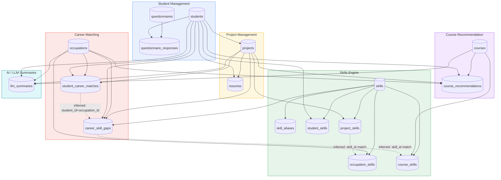

# Career-Matching Platform — Complete Database Relationship Documentation

**Source:** 17 PostgreSQL DDL files (`table_schemas.zip`)
**Schema:** `public` | **Owner:** `manojtungala` | **Surrogate keys:** all `uuid` (default `uuid_generate_v4()`)

---

# 1. Database Overview

This schema powers an **AI-driven career-matching and course-recommendation platform** for college students. A student creates one or more *projects* (a project = a career exploration session tied to a specific resume), the resume is parsed into extracted skills, those skills are matched against occupation skill profiles to compute career-fit percentages, gaps between the student's skills and the target occupation's skills are calculated, courses are recommended to close those gaps, and an LLM generates natural-language summaries at multiple stages.

High-level flow:

```
Student
  ↓
Project  (one exploration "run" for a student)
  ↓
Resume   (uploaded & parsed within a project)
  ↓
Project Skills  (skills extracted from the resume)
  ↓
Career Matching  (project skills vs. occupation skill profiles → student_career_matches)
  ↓
Skill Gap Analysis  (career_skill_gaps)
  ↓
Course Recommendations  (courses that close the gaps)
  ↓
LLM Summaries  (narrative explanation of matches/gaps/recommendations)
```

In parallel, a **persistent skill profile** is maintained per student (`student_skills`) independent of any single project, and a **questionnaire subsystem** (`questionnaires` / `questionnaire_responses`) collects preference data used to refine matching (inferred — no direct FK to matching tables, but same `student_id`).

---

# 2. Domain Grouping

| Domain | Tables |
|---|---|
| **Student Management** | `students`, `questionnaires`, `questionnaire_responses` |
| **Project Management** | `projects`, `resumes` |
| **Skills Engine** | `skills`, `skill_aliases`, `student_skills`, `project_skills`, `occupation_skills`, `course_skills` |
| **Career Matching** | `occupations`, `student_career_matches`, `career_skill_gaps` |
| **Course Recommendation** | `courses`, `course_recommendations` |
| **AI/LLM Summaries** | `llm_summaries` |

---

# 3. Table Summary

## students
**Purpose:** Master record of a student/user — profile, academic info, and job/career preferences (location, target role, internship/work-mode preferences).
**Primary Key:** `student_id` (uuid)
**Foreign Keys:** none
**Referenced By:** `projects`, `resumes`, `questionnaire_responses`, `student_skills`, `student_career_matches`, `career_skill_gaps`, `course_recommendations`, `llm_summaries`
**Relationships:** Root entity of the entire schema — one student fans out into every other domain (1 → many everywhere).
**Notable constraints:** `email` UNIQUE; CHECK on `internship_preference` ∈ {free, paid, both}; CHECK on `work_mode_preference` ∈ {office, remote, hybrid}.

## projects
**Purpose:** A discrete career-exploration "session" owned by a student (e.g., one resume-driven matching run). Has a `status` lifecycle (default `active`).
**Primary Key:** `project_id` (uuid)
**Foreign Keys:** `student_id` → `students.student_id` (ON DELETE CASCADE)
**Referenced By:** `resumes`, `project_skills`, `student_career_matches`, `career_skill_gaps`, `course_recommendations`, `llm_summaries`
**Relationships:** One student → many projects (1:N). One project → many resumes/skills/matches/gaps/recommendations/summaries (1:N each).

## resumes
**Purpose:** Stores an uploaded resume file (URL, raw extracted text, parse timestamp) for a student, optionally tied to a specific project.
**Primary Key:** `resume_id` (uuid)
**Foreign Keys:** `student_id` → `students.student_id` (CASCADE); `project_id` → `projects.project_id` (CASCADE, nullable)
**Referenced By:** none
**Relationships:** One student → many resumes; one project → many resumes (schema allows it, though business logic likely intends one active resume per project — see Section 8).

## questionnaires
**Purpose:** Catalog of survey/intake questions (text + type, e.g., multiple-choice/free-text) used to gather student preferences.
**Primary Key:** `question_id` (uuid)
**Foreign Keys:** none
**Referenced By:** `questionnaire_responses`
**Relationships:** One question → many responses (1:N, one per student who answers it).

## questionnaire_responses
**Purpose:** Stores a student's answer to a given questionnaire question.
**Primary Key:** `response_id` (uuid)
**Foreign Keys:** `student_id` → `students.student_id` (CASCADE); `question_id` → `questionnaires.question_id` (CASCADE)
**Referenced By:** none
**Relationships:** Junction-like fact table linking `students` ↔ `questionnaires` (M:N realized as two 1:N relationships). **No UNIQUE(student_id, question_id)** — a student could answer the same question multiple times (see Section 8).

## skills
**Purpose:** Master catalog of normalized skill names/categories (the "dictionary" of all skills recognized by the system).
**Primary Key:** `skill_id` (uuid)
**Foreign Keys:** none
**Referenced By:** `skill_aliases`, `student_skills`, `project_skills`, `occupation_skills`, `course_skills`, `career_skill_gaps`
**Relationships:** Central hub of the Skills Engine domain — referenced by every other skill-mapping table. `skill_name` is UNIQUE.

## skill_aliases
**Purpose:** Alternate names/spellings for a canonical skill (e.g., "JS" → "JavaScript"), used during LLM skill-extraction normalization.
**Primary Key:** `alias_id` (uuid)
**Foreign Keys:** `skill_id` → `skills.skill_id` (CASCADE)
**Referenced By:** none
**Relationships:** One skill → many aliases (1:N). `alias_name` UNIQUE globally.

## student_skills
**Purpose:** A student's persistent/global skill profile (independent of any one project), with proficiency and confidence scoring and a `source` (e.g., resume, questionnaire, manual).
**Primary Key:** `student_skill_id` (uuid)
**Foreign Keys:** `student_id` → `students.student_id` (CASCADE); `skill_id` → `skills.skill_id` (CASCADE)
**Referenced By:** none
**Relationships:** Junction table realizing **students ↔ skills (M:N)**. `UNIQUE(student_id, skill_id)` prevents duplicate skill entries per student. CHECK constraints: `proficiency_level` 1–10, `confidence_score` 0–1.

## projects (skills context) → project_skills
**Purpose:** Skills extracted specifically from a given project's resume (the "raw" LLM extraction output), with proficiency/confidence/source.
**Primary Key:** `project_skill_id` (uuid)
**Foreign Keys:** `project_id` → `projects.project_id` (CASCADE); `skill_id` → `skills.skill_id` (**no ON DELETE action specified** — defaults to NO ACTION/RESTRICT)
**Referenced By:** none
**Relationships:** Junction table realizing **projects ↔ skills (M:N)**. Unlike `student_skills`/`occupation_skills`/`course_skills`, there is **no UNIQUE(project_id, skill_id)** constraint — duplicate skill rows per project are possible (see Section 8).

## occupations
**Purpose:** Master catalog of target careers/occupations (name, description, average salary, growth outlook) used as the matching target.
**Primary Key:** `occupation_id` (uuid)
**Foreign Keys:** none
**Referenced By:** `occupation_skills`, `student_career_matches`, `career_skill_gaps`, `course_recommendations`, `llm_summaries`
**Relationships:** Central hub of the Career Matching domain. `occupation_name` UNIQUE.

## occupation_skills
**Purpose:** Defines the required skill profile for an occupation — each skill carries a `weight` (importance) for that occupation.
**Primary Key:** `occupation_skill_id` (uuid)
**Foreign Keys:** `occupation_id` → `occupations.occupation_id` (CASCADE); `skill_id` → `skills.skill_id` (CASCADE)
**Referenced By:** none
**Relationships:** Junction table realizing **occupations ↔ skills (M:N)**. `UNIQUE(occupation_id, skill_id)`. CHECK: `weight` 0–100.

## student_career_matches
**Purpose:** Stores the computed match percentage between a student's (project's) skill set and a candidate occupation, plus its rank among all candidate occupations for that run.
**Primary Key:** `match_id` (uuid)
**Foreign Keys:** `student_id` → `students.student_id` (CASCADE); `occupation_id` → `occupations.occupation_id` (CASCADE); `project_id` → `projects.project_id` (CASCADE, **NOT NULL**)
**Referenced By:** none
**Relationships:** Junction/fact table realizing **students ↔ occupations (M:N)**, scoped to a specific project. `UNIQUE(student_id, occupation_id)` — note this unique constraint does **not** include `project_id`, meaning a student can only have one match row per occupation across *all* their projects (see Section 8). CHECK: `match_percentage` 0–100.

## career_skill_gaps
**Purpose:** For a given student/occupation pairing, records the percentage gap for each specific missing/weak skill — the diagnostic detail behind a career match.
**Primary Key:** `gap_id` (uuid)
**Foreign Keys:** `student_id` → `students.student_id` (CASCADE); `occupation_id` → `occupations.occupation_id` (CASCADE); `skill_id` → `skills.skill_id` (CASCADE); `project_id` → `projects.project_id` (CASCADE, nullable)
**Referenced By:** none
**Relationships:** Three-way junction/fact table: **students ↔ occupations ↔ skills**. `UNIQUE(student_id, occupation_id, skill_id)` (project-independent uniqueness — see Section 8). CHECK: `gap_percentage` 0–100.

## courses
**Purpose:** Catalog of learning courses (LMS content) with duration, level, and active flag, used to remediate skill gaps.
**Primary Key:** `course_id` (uuid)
**Foreign Keys:** none
**Referenced By:** `course_skills`, `course_recommendations`, `llm_summaries`
**Relationships:** Central hub of the Course Recommendation domain.

## course_skills
**Purpose:** Defines which skills a course teaches/covers, with a `coverage_weight` indicating how much of that skill the course addresses.
**Primary Key:** `course_skill_id` (uuid)
**Foreign Keys:** `course_id` → `courses.course_id` (CASCADE); `skill_id` → `skills.skill_id` (CASCADE)
**Referenced By:** none
**Relationships:** Junction table realizing **courses ↔ skills (M:N)**. `UNIQUE(course_id, skill_id)`. CHECK: `coverage_weight` 0–100.

## course_recommendations
**Purpose:** The recommendation engine's output — which course is recommended to a student for a given occupation target, how much of the gap it covers, and its rank among alternatives.
**Primary Key:** `recommendation_id` (uuid)
**Foreign Keys:** `student_id` → `students.student_id` (CASCADE); `occupation_id` → `occupations.occupation_id` (CASCADE); `course_id` → `courses.course_id` (CASCADE); `project_id` → `projects.project_id` (CASCADE, nullable)
**Referenced By:** none
**Relationships:** Three-way junction/fact table: **students ↔ occupations ↔ courses**. `UNIQUE(student_id, occupation_id, course_id)` (project-independent — see Section 8). CHECK: `coverage_percentage` 0–100.

## llm_summaries
**Purpose:** Stores AI/LLM-generated narrative text (e.g., resume summary, match explanation, gap explanation, course rationale) — `summary_type` differentiates the kind of summary, scoped to a project and optionally an occupation/course.
**Primary Key:** `summary_id` (uuid)
**Foreign Keys:** `student_id` → `students.student_id` (CASCADE); `project_id` → `projects.project_id` (CASCADE, **NOT NULL**); `occupation_id` → `occupations.occupation_id` (CASCADE, nullable); `course_id` → `courses.course_id` (CASCADE, nullable)
**Referenced By:** none
**Relationships:** Polymorphic-style fact table touching every major hub (student, project, occupation, course) depending on `summary_type`. No UNIQUE constraint — multiple summaries of the same type can exist (versioning/history — likely intentional).

---

# 4. Common Keys Matrix

| Key | Referenced Tables |
|---|---|
| `student_id` | students (PK), projects, resumes, questionnaire_responses, student_skills, student_career_matches, career_skill_gaps, course_recommendations, llm_summaries |
| `project_id` | projects (PK), resumes (nullable), project_skills, student_career_matches (NOT NULL), career_skill_gaps (nullable), course_recommendations (nullable), llm_summaries (NOT NULL) |
| `skill_id` | skills (PK), skill_aliases, student_skills, project_skills, occupation_skills, course_skills, career_skill_gaps |
| `occupation_id` | occupations (PK), occupation_skills, student_career_matches, career_skill_gaps, course_recommendations, llm_summaries (nullable) |
| `course_id` | courses (PK), course_skills, course_recommendations, llm_summaries (nullable) |
| `question_id` | questionnaires (PK), questionnaire_responses |

---

# 5. Mermaid ER Diagram

```mermaid
erDiagram
    STUDENTS ||--o{ PROJECTS : "owns"
    STUDENTS ||--o{ RESUMES : "uploads"
    STUDENTS ||--o{ QUESTIONNAIRE_RESPONSES : "answers"
    STUDENTS ||--o{ STUDENT_SKILLS : "has profile"
    STUDENTS ||--o{ STUDENT_CAREER_MATCHES : "matched to"
    STUDENTS ||--o{ CAREER_SKILL_GAPS : "has gaps"
    STUDENTS ||--o{ COURSE_RECOMMENDATIONS : "receives"
    STUDENTS ||--o{ LLM_SUMMARIES : "generates"

    PROJECTS ||--o{ RESUMES : "contains (nullable)"
    PROJECTS ||--o{ PROJECT_SKILLS : "extracts"
    PROJECTS ||--o{ STUDENT_CAREER_MATCHES : "generates"
    PROJECTS ||--o{ CAREER_SKILL_GAPS : "scopes (nullable)"
    PROJECTS ||--o{ COURSE_RECOMMENDATIONS : "scopes (nullable)"
    PROJECTS ||--o{ LLM_SUMMARIES : "scopes"

    QUESTIONNAIRES ||--o{ QUESTIONNAIRE_RESPONSES : "asked via"

    SKILLS ||--o{ SKILL_ALIASES : "has aliases"
    SKILLS ||--o{ STUDENT_SKILLS : "mapped to"
    SKILLS ||--o{ PROJECT_SKILLS : "mapped to"
    SKILLS ||--o{ OCCUPATION_SKILLS : "required by"
    SKILLS ||--o{ COURSE_SKILLS : "taught by"
    SKILLS ||--o{ CAREER_SKILL_GAPS : "missing in"

    OCCUPATIONS ||--o{ OCCUPATION_SKILLS : "requires"
    OCCUPATIONS ||--o{ STUDENT_CAREER_MATCHES : "matched against"
    OCCUPATIONS ||--o{ CAREER_SKILL_GAPS : "targets"
    OCCUPATIONS ||--o{ COURSE_RECOMMENDATIONS : "targeted by"
    OCCUPATIONS ||--o{ LLM_SUMMARIES : "discussed in (nullable)"

    COURSES ||--o{ COURSE_SKILLS : "covers"
    COURSES ||--o{ COURSE_RECOMMENDATIONS : "recommended as"
    COURSES ||--o{ LLM_SUMMARIES : "discussed in (nullable)"

    STUDENTS {
        uuid student_id PK
        varchar full_name
        varchar email UK
        varchar phone
        varchar college_name
        varchar degree_name
        varchar branch_name
        varchar current_year_semester
        int graduation_year
        varchar preferred_job_location
        varchar target_role
        varchar career_interest
        int learning_hours_per_week
        varchar internship_preference
        varchar work_mode_preference
        timestamp created_at
        timestamp updated_at
    }

    PROJECTS {
        uuid project_id PK
        uuid student_id FK
        varchar project_name
        text description
        varchar status
        timestamp created_at
        timestamp updated_at
    }

    RESUMES {
        uuid resume_id PK
        uuid student_id FK
        uuid project_id FK
        varchar file_name
        text file_url
        text raw_text
        timestamp parsed_at
        timestamp created_at
    }

    QUESTIONNAIRES {
        uuid question_id PK
        text question_text
        varchar question_type
        boolean is_active
        timestamp created_at
    }

    QUESTIONNAIRE_RESPONSES {
        uuid response_id PK
        uuid student_id FK
        uuid question_id FK
        text answer_text
        timestamp created_at
    }

    SKILLS {
        uuid skill_id PK
        varchar skill_name UK
        varchar skill_category
        text description
        timestamp created_at
    }

    SKILL_ALIASES {
        uuid alias_id PK
        uuid skill_id FK
        varchar alias_name UK
        timestamp created_at
    }

    STUDENT_SKILLS {
        uuid student_skill_id PK
        uuid student_id FK
        uuid skill_id FK
        int proficiency_level
        numeric confidence_score
        varchar source
        timestamp created_at
    }

    PROJECT_SKILLS {
        uuid project_skill_id PK
        uuid project_id FK
        uuid skill_id FK
        int proficiency_level
        numeric confidence_score
        varchar source
        timestamp created_at
    }

    OCCUPATIONS {
        uuid occupation_id PK
        varchar occupation_name UK
        text description
        numeric average_salary
        varchar growth_outlook
        timestamp created_at
    }

    OCCUPATION_SKILLS {
        uuid occupation_skill_id PK
        uuid occupation_id FK
        uuid skill_id FK
        numeric weight
        timestamp created_at
    }

    STUDENT_CAREER_MATCHES {
        uuid match_id PK
        uuid student_id FK
        uuid occupation_id FK
        uuid project_id FK
        numeric match_percentage
        int rank_position
        timestamp generated_at
    }

    CAREER_SKILL_GAPS {
        uuid gap_id PK
        uuid student_id FK
        uuid occupation_id FK
        uuid skill_id FK
        uuid project_id FK
        numeric gap_percentage
        timestamp created_at
    }

    COURSES {
        uuid course_id PK
        varchar course_name
        text description
        int duration_hours
        varchar level
        boolean is_active
        timestamp created_at
    }

    COURSE_SKILLS {
        uuid course_skill_id PK
        uuid course_id FK
        uuid skill_id FK
        numeric coverage_weight
        timestamp created_at
    }

    COURSE_RECOMMENDATIONS {
        uuid recommendation_id PK
        uuid student_id FK
        uuid occupation_id FK
        uuid course_id FK
        uuid project_id FK
        numeric coverage_percentage
        int recommendation_rank
        timestamp created_at
    }

    LLM_SUMMARIES {
        uuid summary_id PK
        uuid student_id FK
        uuid occupation_id FK
        uuid project_id FK
        uuid course_id FK
        varchar summary_type
        text summary_text
        timestamp created_at
    }
```



---

# 6. Detailed Relationship Walkthrough

**`students.student_id` → `projects.student_id`**
Cardinality: One Student → Many Projects.
Key: `student_id` (FK, `ON DELETE CASCADE`).
Business Meaning: A student can run multiple career-exploration sessions over time (e.g., re-uploading a new resume each semester, or exploring different career tracks).

**`projects.project_id` → `resumes.project_id`**
Cardinality: One Project → Many Resumes (nullable FK).
Key: `project_id`.
Business Meaning: A resume is uploaded within the context of a project. The nullable FK and lack of a uniqueness constraint mean the schema *technically* allows multiple resumes per project or a resume with no project — in practice this is likely intended as 1:1 (one resume drives one project). See Section 8 for the resulting risk.

**`projects.project_id` → `project_skills.project_id`**
Cardinality: One Project → Many Project Skills.
Key: `project_id`.
Business Meaning: The LLM skill-extraction stage produces multiple discrete skill rows (one per detected skill) from a single project's resume.

**`skills.skill_id` ↔ `project_skills.skill_id` / `occupation_skills.skill_id`**
Cardinality: Many-to-Many (Skills ↔ Projects via `project_skills`; Skills ↔ Occupations via `occupation_skills`).
Key: `skill_id`.
Business Meaning: The same canonical skill (e.g., "Python") can appear in many projects and is required by many occupations — this shared vocabulary is what makes skill-based matching possible.

**`project_skills` + `occupation_skills` → `student_career_matches`** *(Inferred Relationship — no direct FK, derived by application logic)*
Cardinality: Many project skills + many occupation skills → one match score per (student, occupation, project).
Business Meaning: The matching algorithm compares a project's extracted skill set against each occupation's weighted skill profile and writes a single aggregate `match_percentage` row. There is no DB-level FK enforcing this computation; it is a business-logic join across `project_skills.skill_id = occupation_skills.skill_id`.

**`student_career_matches` → `career_skill_gaps`** *(Inferred Relationship — linked by shared `student_id` + `occupation_id`, not a direct FK)*
Cardinality: One Career Match → Many Skill Gaps.
Business Meaning: Once a match percentage is computed, the system drills into *which specific skills* are missing/weak for that occupation, producing one gap row per missing skill.

**`career_skill_gaps.skill_id` → `course_skills.skill_id`** *(Inferred Relationship — joined by `skill_id`, not a direct FK)*
Cardinality: Many gaps can map to many courses (via shared skill coverage).
Business Meaning: The recommendation engine searches for courses whose `course_skills` cover the skills identified as gaps, ranking them by `coverage_weight`/`coverage_percentage` to produce `course_recommendations`.

**`courses.course_id` → `course_recommendations.course_id`**
Cardinality: One Course → Many Recommendations (the same course can be recommended to many different students/occupations).
Key: `course_id`.
Business Meaning: Courses are reusable LMS content; a single course like "SQL Fundamentals" may be recommended across hundreds of students targeting data-related occupations.

**`projects.project_id` → `llm_summaries.project_id`**
Cardinality: One Project → Many LLM Summaries.
Key: `project_id` (NOT NULL — every summary must belong to a project).
Business Meaning: At each pipeline stage (resume parsing, match explanation, gap explanation, course rationale) the system can persist a distinct AI-generated narrative, all scoped to the originating project.

**`questionnaires.question_id` → `questionnaire_responses.question_id`**
Cardinality: One Question → Many Responses.
Key: `question_id`.
Business Meaning: A standardized intake survey is answered by many students; responses feed preference signals (career interest, work-mode, etc.) that refine matching, though this connection to the matching engine is currently **inferred** (no FK chain links `questionnaire_responses` to `student_career_matches`).

---

# 7. Recommendation Engine Data Flow

```
Student                          → students
   ↓
Project                          → projects (student_id FK)
   ↓
Resume                           → resumes (student_id, project_id FK)
   ↓
Project Skills (extraction)      → project_skills (project_id, skill_id FK)
   ↓
Occupation Matching              → occupation_skills (skill catalog per occupation)
   ↓                                [inferred join: project_skills.skill_id = occupation_skills.skill_id]
Career Matches                   → student_career_matches (student_id, occupation_id, project_id FK)
   ↓
Skill Gaps                       → career_skill_gaps (student_id, occupation_id, skill_id, project_id FK)
   ↓                                [inferred join: career_skill_gaps.skill_id = course_skills.skill_id]
Course Recommendations           → course_recommendations (student_id, occupation_id, course_id, project_id FK)
   ↓
LLM Summaries                    → llm_summaries (student_id, project_id, occupation_id, course_id FK)
```

Supporting/parallel tables that feed signal into this pipeline without being on the critical path:
- `student_skills` — persistent cross-project skill profile (could seed matching alongside `project_skills`).
- `questionnaires` / `questionnaire_responses` — preference signals (career interest, work mode) — **inferred** input to matching, not FK-linked.
- `skill_aliases` — normalizes raw extracted text (e.g., "JS", "Node") to canonical `skills.skill_id` during the extraction step.

---

# 8. Potential Schema Issues

**Circular Dependencies**
- None detected. The FK graph is a DAG rooted at `students`/`skills`/`occupations`/`courses`/`questionnaires` — no table's foreign keys loop back to a table that (directly or transitively) references it.

**Missing Indexes**
- PostgreSQL does **not** automatically index foreign-key columns. Every FK column shown above (`student_id`, `project_id`, `skill_id`, `occupation_id`, `course_id`, `question_id` across all 12 dependent tables) should have an explicit `CREATE INDEX` for join/lookup performance — none are visible in the DDL beyond what's implied by PK/UNIQUE constraints.
- High-traffic lookup patterns (e.g., "all matches for a student", "all gaps for a project+occupation") will do sequential scans at scale without these.

**Missing Unique Constraints**
- `project_skills` has **no** `UNIQUE(project_id, skill_id)`, unlike its siblings `student_skills`, `occupation_skills`, and `course_skills` which all enforce this pattern. This allows duplicate skill rows for the same project (e.g., "Python" extracted twice with different confidence scores), which could double-count in matching calculations.
- `questionnaire_responses` has no `UNIQUE(student_id, question_id)`, allowing a student to have multiple answers stored for the same question with no clear "current answer" semantics.
- `student_career_matches.UNIQUE(student_id, occupation_id)` does **not** include `project_id`, even though `project_id` is NOT NULL. This means a student can only ever have one match row per occupation **across all their projects combined** — a second project re-matching against the same occupation would violate this constraint (or silently overwrite, depending on app logic). This looks like an unintended gap, since `career_skill_gaps` and `course_recommendations` use a *project-independent* unique key pattern too (`student_id, occupation_id, skill_id` / `student_id, occupation_id, course_id`), reinforcing that the model treats "student+occupation" as the canonical scope but `project_id` is still stored as NOT NULL/required — an inconsistency worth resolving.

**Redundant Tables / Columns**
- `student_id` is duplicated in `resumes`, `student_career_matches`, `career_skill_gaps`, `course_recommendations`, and `llm_summaries` even though each also carries `project_id`, and `project_id` already implies `student_id` via `projects.student_id`. This is denormalization for query convenience but creates a risk of a row's `student_id` and `project_id`→`projects.student_id` going out of sync, since no CHECK/trigger enforces consistency between them.

**Denormalization Opportunities (existing, intentional-looking)**
- The repeated `student_id` + `project_id` pairing across fact tables is a reasonable denormalization for analytics/reporting (avoids extra joins through `projects`), provided it's kept consistent at the application layer.

**Scalability Concerns**
- All PKs/FKs are `uuid` (16 bytes vs. 8-byte `bigint`), which increases index size and can hurt cache locality at very large row counts (millions of `project_skills`/`career_skill_gaps` rows) — a common, deliberate trade-off for distributed-ID generation, but worth monitoring.
- `career_skill_gaps` and `course_recommendations` are positioned to grow combinatorially (students × occupations × skills/courses); without the indexing strategy above, the matching/recommendation queries will degrade as the student base scales.
- No partitioning strategy is evident for time-series-heavy tables (`llm_summaries`, `career_skill_gaps`) that will accumulate historical records per project run.

**Other Observations**
- `project_skills.skill_id` FK has no explicit `ON DELETE` action (defaults to `NO ACTION`), while every other `skill_id` FK in the schema (`student_skills`, `occupation_skills`, `course_skills`, `career_skill_gaps`, `skill_aliases`) uses `ON DELETE CASCADE`. This inconsistency means deleting a `skills` row will be blocked if it's still referenced by `project_skills`, but silently cascade-delete in the other five tables — likely an oversight.
- `llm_summaries.summary_type` is a free-text `varchar` rather than a constrained enum/CHECK, risking inconsistent values (e.g., "match_explanation" vs "MatchExplanation") across application code paths.

---

# 9. Final Architecture Diagram



**Pipeline summary:** `students → projects → resumes → project_skills → (skills-engine join) → occupation_skills → student_career_matches → career_skill_gaps → (skills-engine join) → course_skills → course_recommendations → llm_summaries`, with `student_skills` and the `questionnaires` subsystem feeding parallel, currently FK-unlinked, signal into the matching process.
